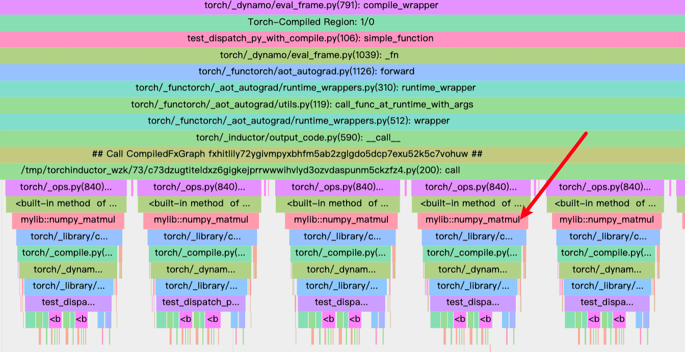
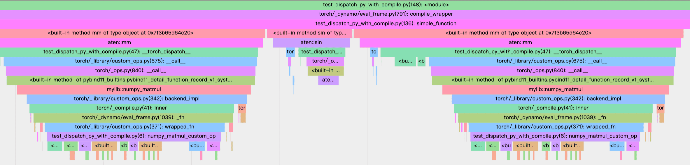

# Eager Mode 正常

一切正常，并且十分简单，请查看示例 `test_dispatch_py.py` 并运行

```bash
python3 test_dispatch_py.py
```

# Compile Mode 无法正常编译

## Try1 Aten + torch.compile 正常

```python
def simple_function(x, w):
    for _ in range(5):
        x = torch.mm(x, w) + torch.mm(torch.sin(x), w)
        x = torch.relu(x)
    return x

compiled_fn = torch.compile(simple_function)
with torch.inference_mode():
    y_compiled = compiled_fn(x, w)

with myprofile:
    with torch.inference_mode():
        for i in range(2):
            y_compiled = compiled_fn(x, w)
```

结果：可以正常编译成连续的 mm / addmm 调用


## Try2 CustomOp + torch.compile 正常

```
def simple_function(x, w):
    for _ in range(5):
        x = torch.ops.mylib.numpy_matmul(x, w) + torch.ops.mylib.numpy_matmul(torch.sin(x), w)
        x = torch.relu(x)
    return x

compiled_fn = torch.compile(simple_function)
with torch.inference_mode():
    for i in range(3):
        y_compiled = compiled_fn(x, w=w)

with myprofile:
    with torch.inference_mode():
        for i in range(2):
            y_compiled = compiled_fn(x, w=w)
```

结果：可以正常编译成连续的 mylib.numpy_matmul 调用



## Try3 TorchDispatchMode + torch.compile 异常

```python
hmd.__enter__()
def simple_function(x, w):
    for _ in range(5):
        x = torch.mm(x, w) + torch.mm(torch.sin(x), w)
        x = torch.relu(x)
    return x

compiled_fn = torch.compile(simple_function)
with torch.inference_mode():
    for i in range(3):
        y_compiled = compiled_fn(x, w)

with myprofile:
    with torch.inference_mode():
        for i in range(2):
            y_compiled = compiled_fn(x, w)
hmd.__exit__(None, None, None)
```

结果：无法正常编译，因为 TorchDispatchMode 劫持了 mm 函数，torch.compile 无法识别，compile 后完全是以普通 Python 脚本的方式执行，没有 Graph Capture 和 JIT 

对比 Try1/Try2，没有生成 /tmp/torchinductor...



